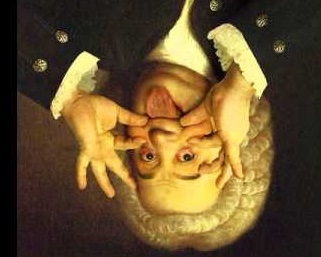

# InverseBach

## version
1.0.0
## Introduction
A program that generates user specified random music.
## Dependency
* python3, command: `sudo apt-get install python3`
* GNU Lilypond, command: `sudo apt-get install lilypond`
* python3-tk, command: `sudo apt-get install python3-tk`
## Run
Simply run `main.py` and follow instructions

## Limitations and Simplifications
Generating music using an algorithm is tedeous and difficult. Thus, 
some simplifications were made so that this project is possible.

1. This program can only generate Baroque menuets.
2. All the sharps are represented by flats. ex, F# is represented as Gb
3. The menuets that are generated are all in major keys
4. The transposition key is only one sharp or one flat away from the 
original key
5. The cadences are authentic and half only. With authentic cadence as 5-1 
and half cadence as 1-5. 
6. All the chords that are generated are basic chords. No dominant 7th 
or diminished 7th exist. However, chords may be in different inversions. 
7. All notes are either quarter, half, eighth, dotted quarte, dotted half. 
There are no triplets or sixteenth notes available. 
8. The range for melody is from a3 to a5 on the grand piano. 
The range for harmony is from a1 to a3 on the grand piano.
9. Only one chord per measure.
10. The form of the menuet is restricted to rounded binary. 

## Main Algorithm
The Baroque menuet has 16 measure, 4 cadences, 1 transpose key 
and 2 repeats.Our main idea is to generate the chord progressions of 
each measure, and then fill in the notes correspondingly.The chord 
progression follow certain rules, such as every line usually begins with 
the tonic chord progression (1), and ends with an authentic cadence (5-1).
Therefore, the only random part of the chord progression generation is the 
second bar. Musically speaking, 1-2-5-1 , 1-4-5-1 , and 1-6-5-1 are strong 
chord progressions, so we randomly picked a number in [2,4,6] to be the chord 
progression of the second bar. 

So now we have the chord progression, and each chord has 3 notes associated 
with it, named "chord_note" in this program. It is good to avoid huge leaps 
in the melody. So each chord note is randomly generated based on its 
previous chord note such that the interval between two chord notes are limited 
and the selected chord notes will not keep on repeating itself. 

Then is the passing notes of the melody. For every measure, there are 10 rhythms 
to choose from, called motives. And the position of the passing notes are generated 
based on the selected motive. The pitch of the passing note is picked based on 
the distance between the two chord notes. 

Lastly is the harmony. Usually 3rds and 6ths forms good harmony. That is, when the  
harmony forms a 3rd or 6th interval with the melody notes, it sounds strong.  
Based on this principle, the harmony chord notes are first selected then decorated 
to for the base line of the menuet.
